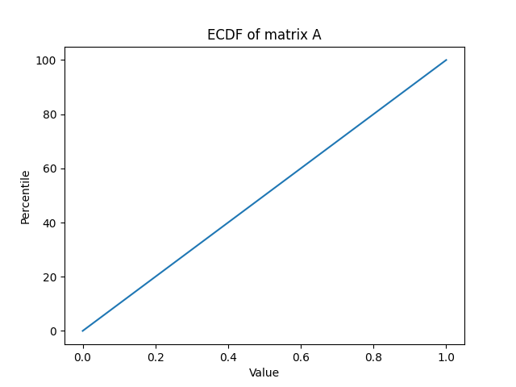
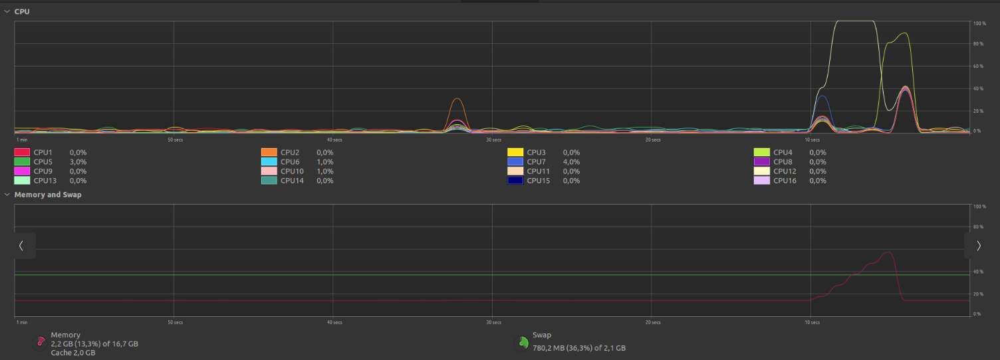

# MatrixMultiplication

Programming assignment for University of Helsinki course Cloud and Edge computing. The main focus in this project is in the benchmarking and evaluation of the solution, not in the code itself.

The assignment:
```
Multiply the three matrices: A, B, and C;  i.e., you are expected to find the matrix D where D=(A*B)*C. 
A, B, and, C contain random numbers in the range of (0,1) and the dimensions of the matrices are as follows. 
A is a matrix with dimension 10^6 x 10^3,
B is a matrix with dimension 10^3 x 10^6,
C is a matrix with dimension 10^6 x 1.
```


## How to run it

1. `git clone git@github.com:Melimet/MatrixMultiplication.git` & cd inside the cloned repo
2. Run these commands to enter venv and install dependencies
```
python3 -m venv .venv
source .venv/bin/activate
pip install -r requirements.txt
```

3. The script can now be run with `python3 src/main.py`

# P1 - Matrix Multiplication 
*Erkka Rahikainen*

## 1. Availability (0.5 points)

Code for the submission is available in https://github.com/Melimet/MatrixMultiplication.

## 2. Programming Languages and Libraries (0.5 points)

I chose Python and NumPy for this task since with these tools the task can be completed very efficiently and with fewer lines of code. Matplotlib is used for illustration of the data.

## 3. Methodology (2 points)

Matrices are created with the help of NumPy's random functionalites. The function that generates the matrices is very simple:
```
def generate_matrix(dimensions) -> list:
  width, height = dimensions
  
  rng = np.random.default_rng()
  
  matrix = rng.random(size=[width, height], dtype=np.float32)

  return matrix

```

The matrices are multiplied with NumPy's [matmul](https://numpy.org/doc/stable/reference/generated/numpy.matmul.html) function. The line of code responsible for this is as follows:
```
multiplied_matrix = np.matmul(matrix_a, np.matmul(matrix_b, matrix_c))
```
The test data is gathered by monitoring the CPU and memory usage during execution of the program from the operating system's(Ubuntu 22.04) resource panel. Only the bare minimum of other programs will be run to reduce noise in the gathered data. Generation of matrix A ECDF image is not included in the tests.


## 4. Dataset (2 points)

The values in the generated dataset are evenly distributed between 0 and 1. The image below illustrates this. The image was generated using matplotlib.



## 5. Evaluation (2 points)

In the image below is the CPU and Memory usage during execution of the program. The python script is executed 10 seconds mark so only the right hand side of the image is relevant. From the graph we can infer that CPU 12 is at maximum capacity during the generation of the dataset, but during the multiplication of the matrices multiple processors take over. I would say that the data set generation step is completed on a single thread while the multiplication is multithreaded.

Memory usage only ever reaches 60% thanks to my optimizations with the float size and the order which the matrices are calculated in.



## 6. Discussion (3 points)

I faced issues with running out of memory when generating the randomized matrices, since Python's default size for floats is 64 bits. I solved this issue by halving the created float value's bit size down to 32 bits.

I probably would have faced issues with memory a second time since calculating (A * B) * C would have ended up with a matrix shaped 1000000 x 1000000, but I quickly realised that [(A * B) * C = A * (B * C)](https://en.wikipedia.org/wiki/Matrix_multiplication#Associativity).

I guess that the point of this assignment was to prove that not every problem should be solved with just using a more powerful machine(or buying more cloud compute!), but just coming up with smart ways to optimize the program. This was also a great excuse to refresh my memory on matrix calculations :D

My implementation was able to compute matrix D with the values given in the assignment.